# Firework Android SDK Examples
This repo holds the Firework Android SDK example applications.

**List of example apps:**

* [View Options](#view-options-example-app)
* [Feed Resources](#feedresources-example-app)
* [Single-Host Livestream](#single-host-livestream-example-app)
* [Multi-Host Livestream](#multi-host-livestream-example-app)
* [Shopping](#multi-host-livestream-example-app)
* [Compose](#jetpack-compose-example-app)

**Read more about the integration here** https://docs.firework.tv/

---

## View Options example app

This example app demonstrates all possible view options that can be used for the `VideoFeedView` initialization.

[View Options example app](view_options)

| Customized View Options                                  | Player screen                                            |
| -------------------------------------------------------- | -------------------------------------------------------- |
| 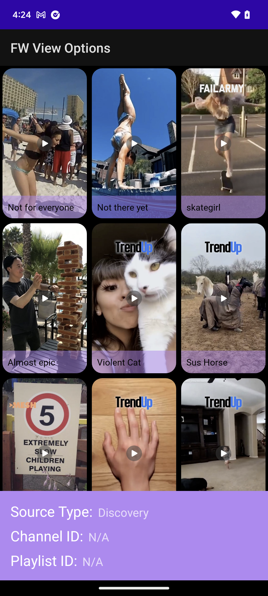 | 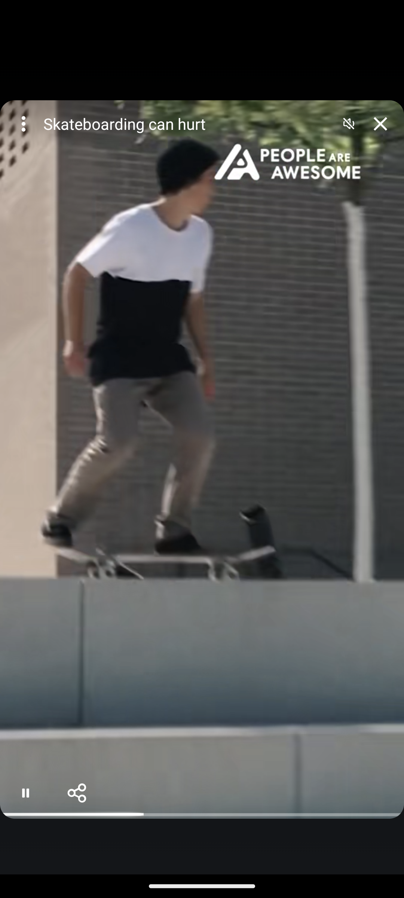 |

---

## Feed Resources example app

In this example app, the `VideoFeedView` is initialized with different feedResources: Discovery, Playlist, Channel, Dynamic Content.

| Discovery Feed                                     | Player screen                                      |
| -------------------------------------------------- | -------------------------------------------------- |
| 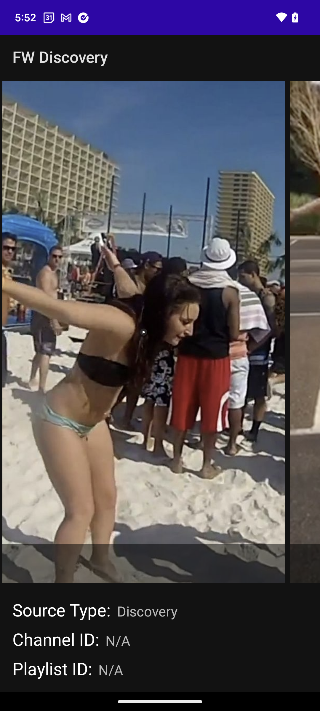 |  |

| Channel Feed                                     | Player screen                                      |
| -------------------------------------------------- | -------------------------------------------------- |
| 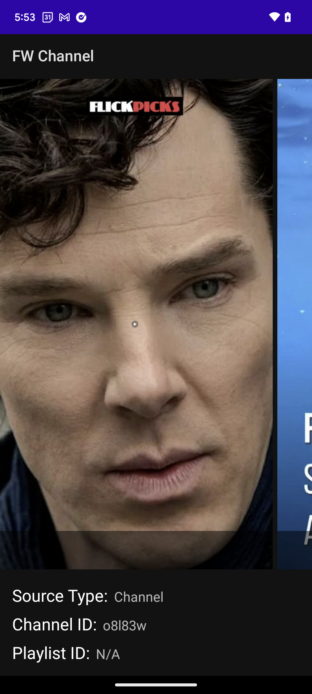 |  |

| Playlist Feed                                     | Player screen                                      |
| -------------------------------------------------- | -------------------------------------------------- |
| 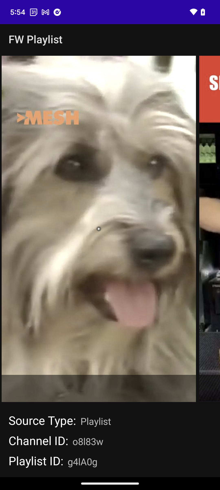 |  |

| Dynamic Feed                                     | Player screen                                      |
| -------------------------------------------------- | -------------------------------------------------- |
|  |  |

---

## Single-Host Livestream example app

In this example app, the `VideoFeedView` is initialized for showing single-host Livestreams.

[Single-Host Livestream example app](single_host_livestream)

| Livestream Feed                                              | Livestream Player                                            | Livestream Features                                          |
| ------------------------------------------------------------ | ------------------------------------------------------------ | ------------------------------------------------------------ |
| 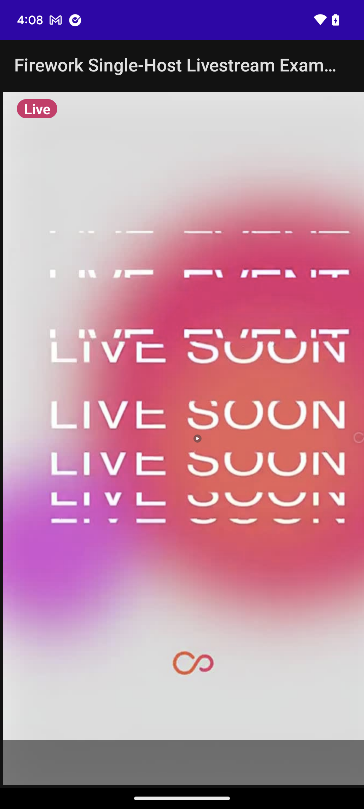 | 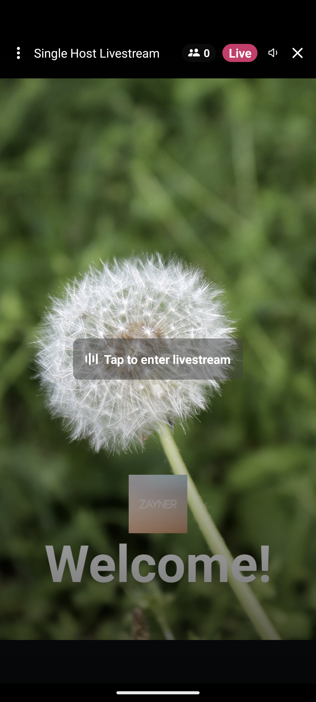 | 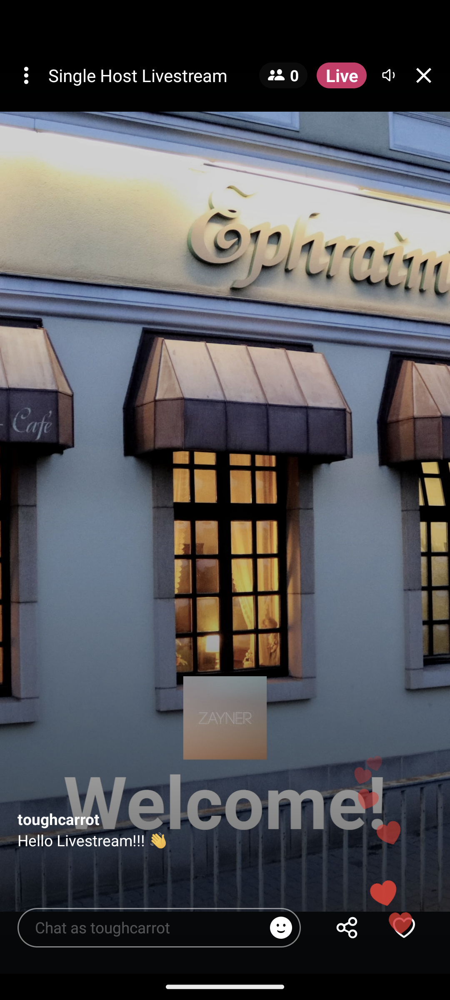 |

---

## Multi-Host Livestream example app

In this example app, the `VideoFeedView` is initialized for showing multi-host Livestreams.

[Multi-Host Livestream example app](multi_host_livestream)

| Livestream Feed                                              | Livestream Player                                            | Livestream Features                                          |
| ------------------------------------------------------------ | ------------------------------------------------------------ | ------------------------------------------------------------ |
| 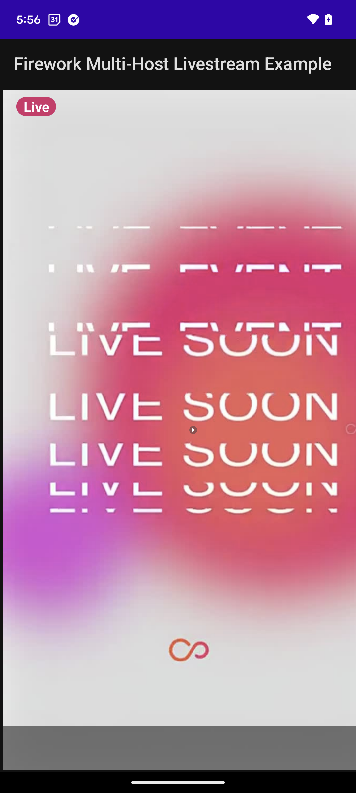 | 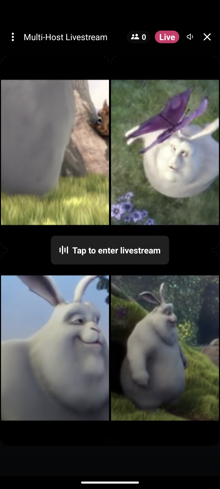 | 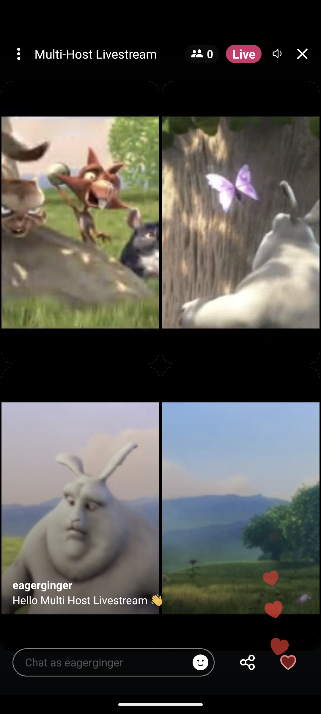 |

---

## Shopping example app

In this example app, the `VideoFeedView` is initialized and integrated with the shopping features of the SDK.

[Shopping example app](shopping)

|         Shopping Button         |          Shopping Cart          |
| ------------------------------- | ------------------------------- |
| 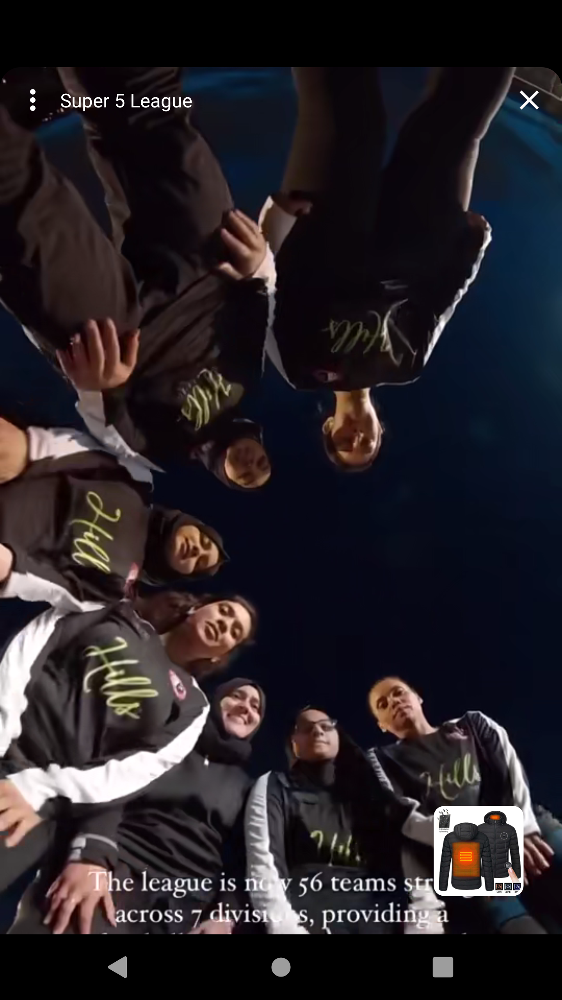 | 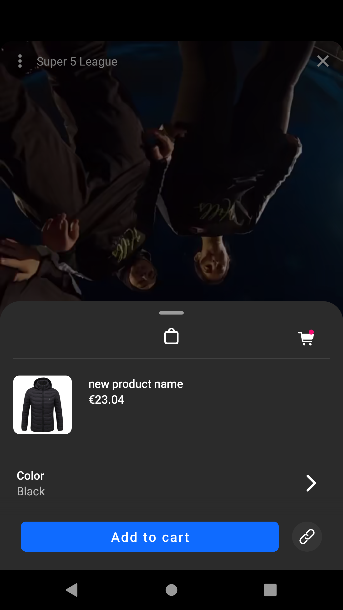 |

## Jetpack Compose example app

In this example app, the `VideoFeedView` is initialized for showing a discovery feed using Jetpack Compose.

[Compose example app](compose)

| Discovery Feed                                   | Player screen                                 |
|--------------------------------------------------|-----------------------------------------------|
| 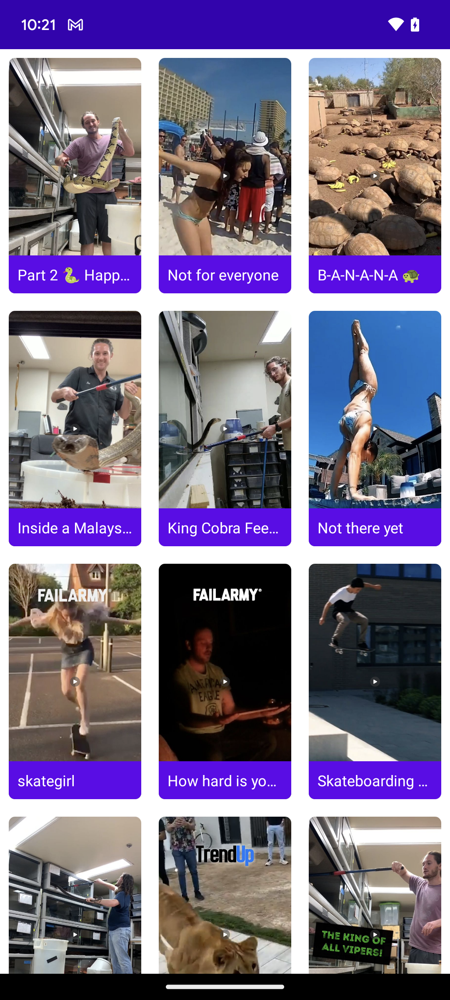 | 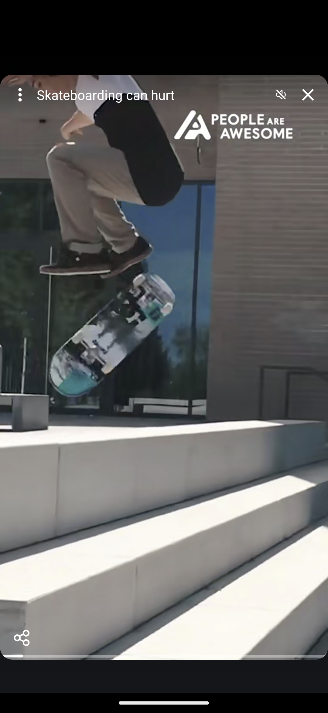 |

---
