# Firework Android SDK Examples 
This repo holds the Firework Android SDK example applications.

**List of example apps:**

* [View Options](#view-options-example-app)
* [Feed Integration](#feed-integration-example-app)
* [Feed Resources](#feed-resources-example-app)
* [Single-Host Livestream](#single-host-livestream-example-app)
* [Multi-Host Livestream](#multi-host-livestream-example-app)
* [Shopping](#shopping-example-app)
* [Share Link](#share-link-example-app)
* [Picture In Picture](#picture-in-picture-example-app)
* [Jetpack Compose](#jetpack-compose-example-app)
* [Story Block](#story-block-example-app)

**Read more about the integration here** https://docs.firework.tv/

---

## View Options example app

This example app demonstrates all possible view options that can be used for the `FwVideoFeedView` initialization.

The view options can be set in 3 different methods:

* Using `FwVideoFeedView`'s attributes in the XML layout file
* Using `ViewOptions` Builders at runtime
* Using `viewOptions` Kotlin DSL methods at runtime

[View Options example app](view_options)

| Customized View Options                                  | Player screen                                            |
| -------------------------------------------------------- | -------------------------------------------------------- |
| 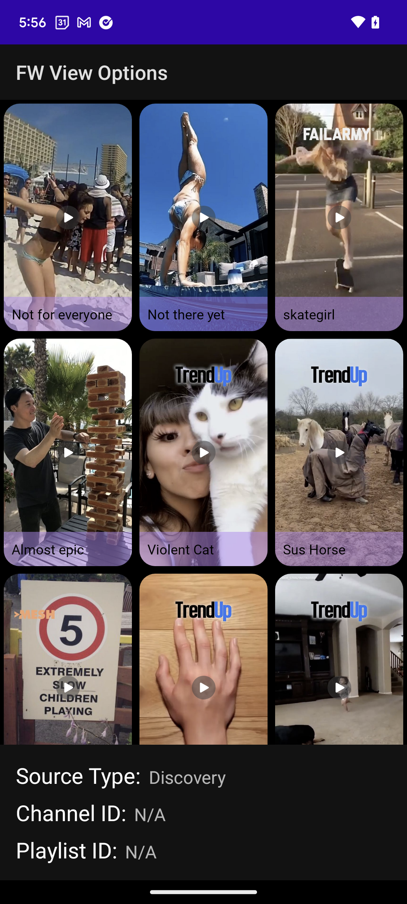 |  |

---

## Feed Integration example app

This example app demonstrates the following scenarios of `FwVideoFeedView` integration: The app
shows how to integrate
`FwVideoFeedView` in activity, fragment, recycler view, and remove/add `FwVideoFeedView` from the
container on the runtime.

* `FwVideoFeedView` integrated in activity
* `FwVideoFeedView` integrated in fragment
* `FwVideoFeedView` integrated in recycler view
* `FwVideoFeedView` add/removed from the container on the runtime.

[Feed Integration example app](feed_integration)

| FwVideoFeedView in Activity                                        | FwVideoFeedView in recycler view                                   |
|--------------------------------------------------------------------|--------------------------------------------------------------------|
| 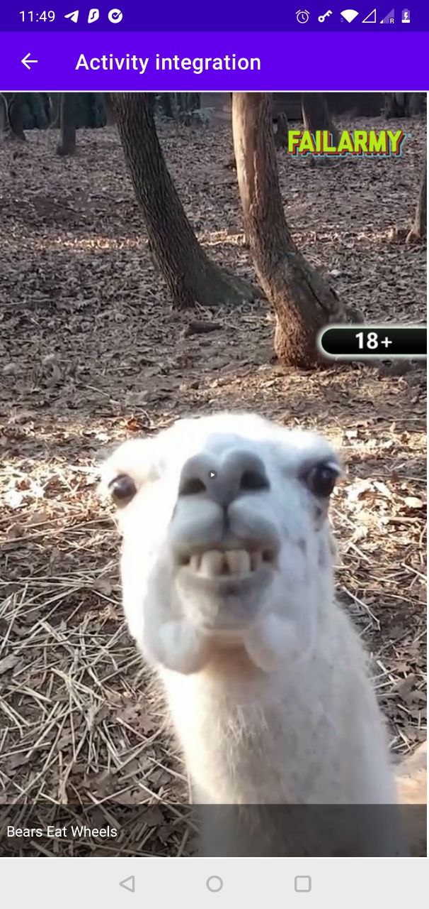 |  |

---

## Feed Resources example app

[Feed Resources example app](feed_resources)

In this example app, the `FwVideoFeedView` is initialized with different feedResources: Discovery, Playlist, Channel, Dynamic Content, Channel Hashtags.

| Discovery Feed                                               | Player screen                                                |
| ------------------------------------------------------------ | ------------------------------------------------------------ |
|  |  |

| Channel Feed                                                 | Player screen                                                |
| ------------------------------------------------------------ | ------------------------------------------------------------ |
|  |  |

| Playlist Feed                                                | Player screen                                                |
| ------------------------------------------------------------ | ------------------------------------------------------------ |
| 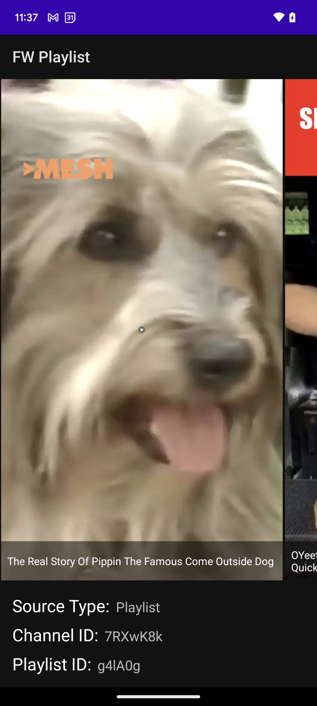 |  |

| Dynamic Feed                                                 | Player screen                                                |
| ------------------------------------------------------------ | ------------------------------------------------------------ |
|  |  |

| Channel Hashtags Feed                                                          | Player screen                                                                 |
|--------------------------------------------------------------------------------|-------------------------------------------------------------------------------|
| 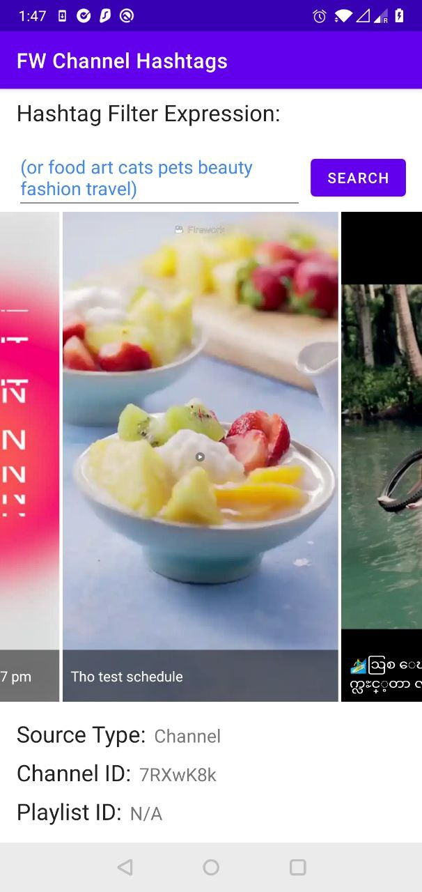 | 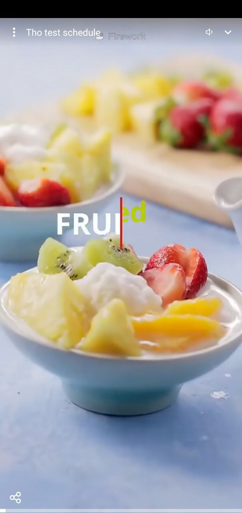 |

| Sku Feed                                                          | Player screen                                                                 |
|--------------------------------------------------------------------------------|-------------------------------------------------------------------------------|
| 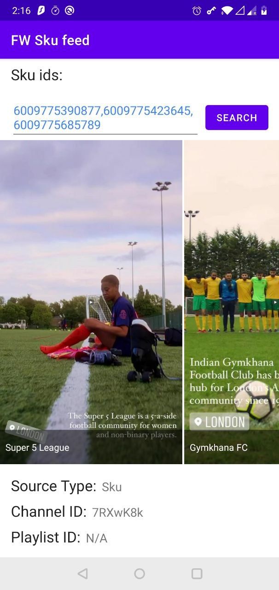 | 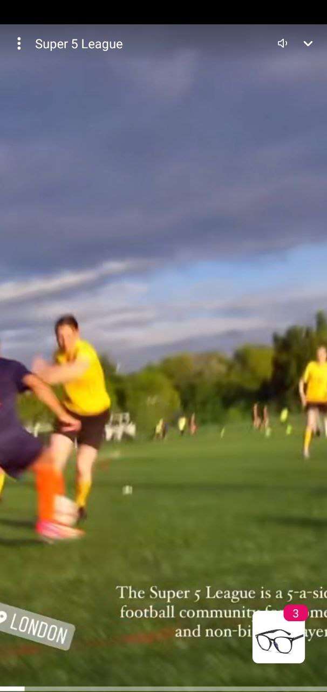 |

| Single Content Feed                                                          | Player screen                                                                 |
|--------------------------------------------------------------------------------|-------------------------------------------------------------------------------|
| 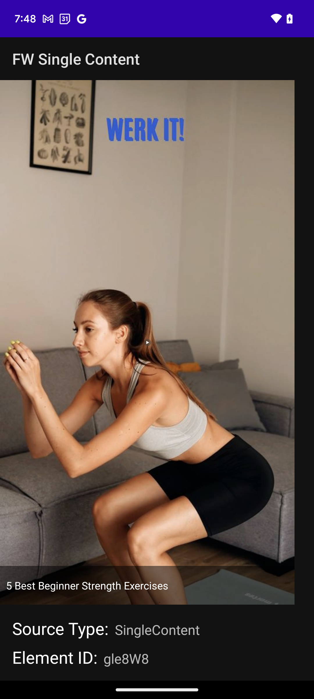 | 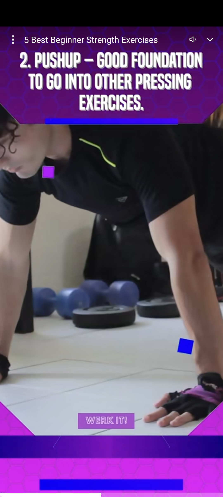 |

---

## Single-Host Livestream example app

In this example app, the `FwVideoFeedView` is initialized for showing single-host Livestreams.

You need a feed resource with a Single Host Livestream item.

[Single-Host Livestream example app](single_host_livestream)

| Livestream Feed                                              | Livestream Player                                            | Livestream Features                                          |
| ------------------------------------------------------------ | ------------------------------------------------------------ | ------------------------------------------------------------ |
|  |  |  |

---

## Multi-Host Livestream example app

In this example app, the `FwVideoFeedView` is initialized for showing multi-host Livestreams.

You need a feed resource with a Multiple Host Livestream item.

[Multi-Host Livestream example app](multi_host_livestream)

| Livestream Feed                                              | Livestream Player                                            | Livestream Features                                          |
| ------------------------------------------------------------ | ------------------------------------------------------------ | ------------------------------------------------------------ |
|  |  |  |

---

## Shopping example app

In this example app, the `FwVideoFeedView` is initialized and integrated with the shopping features of the SDK.
The app has two screens which demonstrate how to setup shopping for "Shopping cart mode" and "Shop now mode".

[Shopping example app](shopping)

| Video with products                              | Product details page                             |
|--------------------------------------------------|--------------------------------------------------|
|  |  |

| Shopping cart mode                                | Shop now mode                                     |
|---------------------------------------------------|---------------------------------------------------|
| 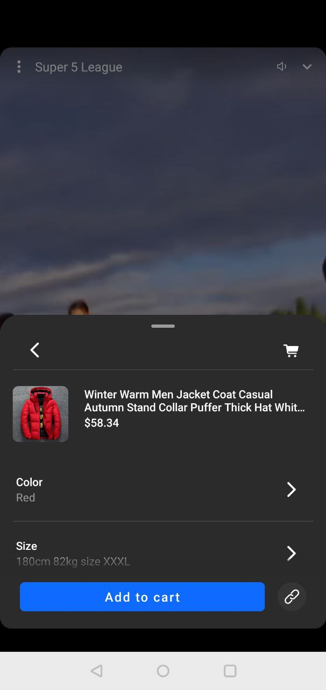 | 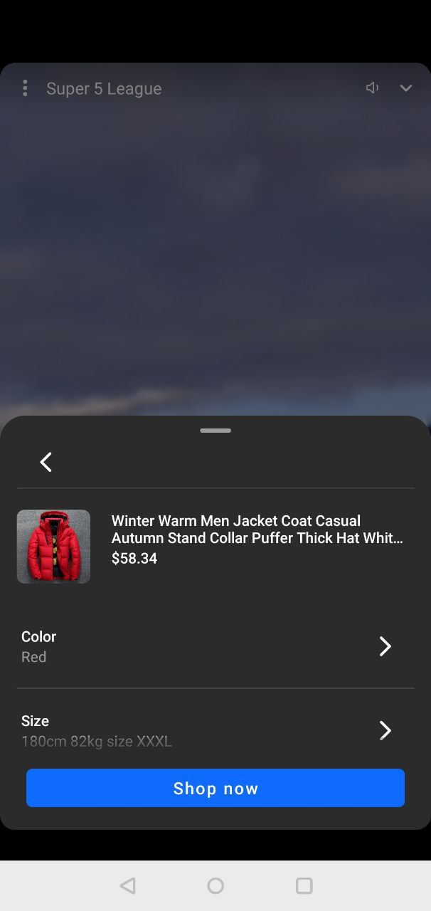 |

---
## Share link example app

[Share link example app](share_link)

This example app demonstrates the share link functionality.
It contains two activities:

1. `MainActivity` - allows to lunch player and share the video
2. `ShareLinkActivity` - handles the deep link and opens the shared video.

Also, this example demonstrates how to replace the base URL of the shared video with a custom one.

**Note**: [Starting in Android 12 (API level 31)](https://developer.android.com/about/versions/12/behavior-changes-all#web-intent-resolution), a generic web intent resolves to an activity in your app only if your app is approved for the specific domain contained in that web intent. If your app isn't approved for the domain, the web intent resolves to the user's default browser app instead.

---
## Picture-in-picture example app

In this example app, the `FwVideoFeedView` is initialized with the picture-in-picture feature enabled.

The user can switch to the PiP mode if the device supports and this feature is not disabled for the app by

* Leaving the app while the player is playing
* Pressing the down chevron on the player
* When the app calls the related public API

[Picture-in-picture example app](picture_in_picture )

| PiP Feed                                              | Player screen in PiP mode                                    |
| ----------------------------------------------------- | ------------------------------------------------------------ |
|  |  |

---
## Jetpack Compose example app

In this example app, the `FwVideoFeedView` is initialized for showing a discovery feed using Jetpack Compose.

[Jetpack Compose example app](compose)

| Discovery Feed                                   | Player screen                                 |
| ------------------------------------------------ | --------------------------------------------- |
|  |  |

---

## Story block example app

This example app demonstrates the usage of StoryBlock component.
This component allows to embed pager player directly in the host app's view hierarchy.

[Story block example app](story_block)

| Story block                                             | Fullscreen Story Block                                    |
|---------------------------------------------------------|-----------------------------------------------------------|
| 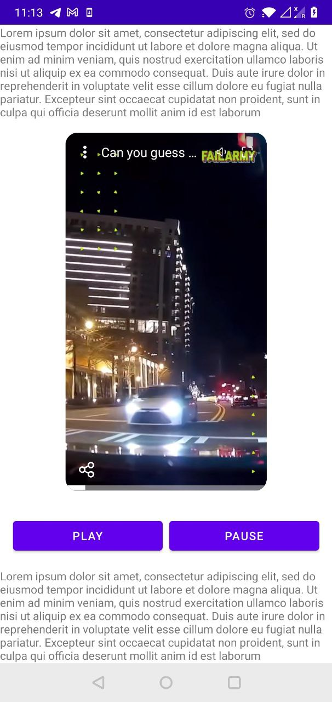 | 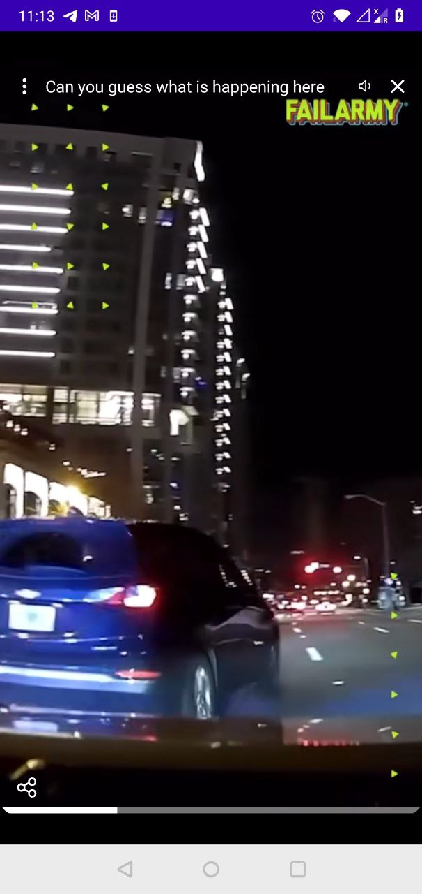    |

---
